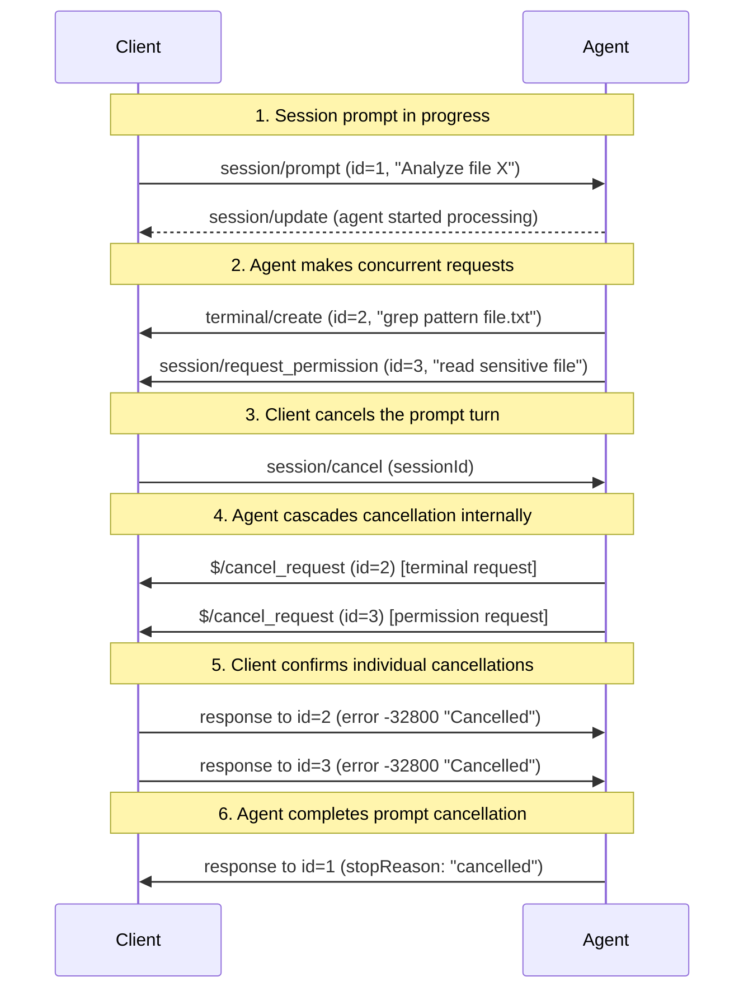

ACP uses JSON-RPC 2.0 for making requests and getting responses.

The JSON-RPC specification doesn't define any standard mechanism for request cancellation and keeps it up to the implementation.

## `$/cancel_request` Notification

In order to provide a consistent approach to cancellation, ACP defines a `$/cancel_request` notification that can be sent to cancel requests.

Cancellation will remain optional as it might not be implementable in all clients or servers. For example if the implementation uses a single threaded synchronous programming language then there is little it can do to react to a `$/cancel_request` notification.

When a `$/cancel_request` notification is received by a supporting implementation, the implementation:

- **MUST** cancel the corresponding request activity and all nested activities related to that request
- **MAY** finish sending any pending notifications before responding
- **MUST** send one of these responses for the original request:
  - A valid response with appropriate data (such as partial results or cancellation marker)
  - An error response with code [`-32800` (Request Cancelled)](./schema#errorcode)

The calling side **MAY** implement graceful cancellation processing by waiting for the response from the remote side.

Cancellation **MAY** also be done explicitly on a per-feature basis within the protocol to cover specific scenarios (e.g., cancellation of a [prompt turn](./prompt-turn#cancellation))

## Internal Cancellation

Requests can also be cancelled internally by the executing party without receiving `$/cancel_request`:

- **Client-side examples**: User closes IDE, switches to different project, file becomes unavailable
- **Agent-side examples**: LLM context limit reached, internal timeout, resource constraints

When internal cancellation occurs, the executing party **MUST**:

- Send the same `-32800` (Cancelled) error response as if `$/cancel_request` was received
- Ensure consistent behavior regardless of cancellation source

## Example: Cascading Cancellation Flow

