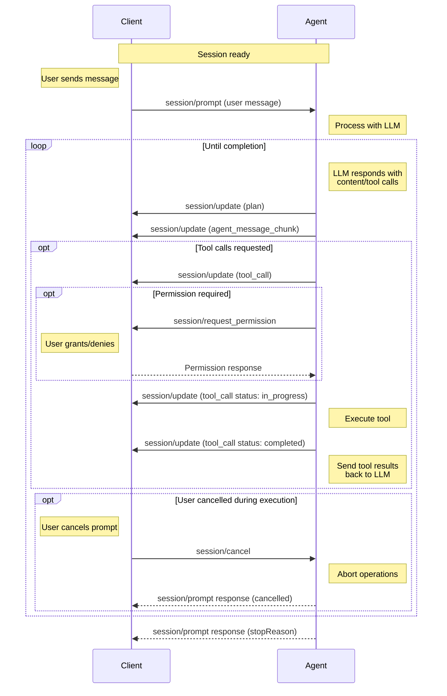

A prompt turn represents a complete interaction cycle between the [Client](./overview#client) and [Agent](./overview#agent), starting with a user message and continuing until the Agent completes its response. This may involve multiple exchanges with the language model and tool invocations.

Before sending prompts, Clients **MUST** first complete the [initialization](./initialization) phase and [session setup](./session-setup).

## The Prompt Turn Lifecycle

A prompt turn follows a structured flow that enables rich interactions between the user, Agent, and any connected tools.

<br />



### 1. User Message

The turn begins when the Client sends a `session/prompt`:

```json
{
  "jsonrpc": "2.0",
  "id": 2,
  "method": "session/prompt",
  "params": {
    "sessionId": "sess_abc123def456",
    "prompt": [
      {
        "type": "text",
        "text": "Can you analyze this code for potential issues?"
      },
      {
        "type": "resource",
        "resource": {
          "uri": "file:///home/user/project/main.py",
          "mimeType": "text/x-python",
          "text": "def process_data(items):\n    for item in items:\n        print(item)"
        }
      }
    ]
  }
}
```

<ParamField path="sessionId" type="SessionId">
    The [ID](./session-setup#session-id) of the session to send this message to.
</ParamField>
<ParamField path="prompt" type="ContentBlock[]">
    The contents of the user message, e.g. text, images, files, etc.

    Clients **MUST** restrict types of content according to the [Prompt Capabilities](./initialization#prompt-capabilities) established during [initialization](./initialization).

    <Card icon="comments" horizontal href="./content">
      Learn more about Content
    </Card>

</ParamField>

### 2. Agent Processing

Upon receiving the prompt request, the Agent processes the user's message and sends it to the language model, which **MAY** respond with text content, tool calls, or both.

### 3. Agent Reports Output

The Agent reports the model's output to the Client via `session/update` notifications. This may include the Agent's plan for accomplishing the task:

```json expandable
{
  "jsonrpc": "2.0",
  "method": "session/update",
  "params": {
    "sessionId": "sess_abc123def456",
    "update": {
      "sessionUpdate": "plan",
      "entries": [
        {
          "content": "Check for syntax errors",
          "priority": "high",
          "status": "pending"
        },
        {
          "content": "Identify potential type issues",
          "priority": "medium",
          "status": "pending"
        },
        {
          "content": "Review error handling patterns",
          "priority": "medium",
          "status": "pending"
        },
        {
          "content": "Suggest improvements",
          "priority": "low",
          "status": "pending"
        }
      ]
    }
  }
}
```

<Card icon="lightbulb" horizontal href="./agent-plan">
  Learn more about Agent Plans
</Card>

The Agent then reports text responses from the model:

```json
{
  "jsonrpc": "2.0",
  "method": "session/update",
  "params": {
    "sessionId": "sess_abc123def456",
    "update": {
      "sessionUpdate": "agent_message_chunk",
      "content": {
        "type": "text",
        "text": "I'll analyze your code for potential issues. Let me examine it..."
      }
    }
  }
}
```

If the model requested tool calls, these are also reported immediately:

```json
{
  "jsonrpc": "2.0",
  "method": "session/update",
  "params": {
    "sessionId": "sess_abc123def456",
    "update": {
      "sessionUpdate": "tool_call",
      "toolCallId": "call_001",
      "title": "Analyzing Python code",
      "kind": "other",
      "status": "pending"
    }
  }
}
```

### 4. Check for Completion

If there are no pending tool calls, the turn ends and the Agent **MUST** respond to the original `session/prompt` request with a `StopReason`:

```json
{
  "jsonrpc": "2.0",
  "id": 2,
  "result": {
    "stopReason": "end_turn"
  }
}
```

Agents **MAY** stop the turn at any point by returning the corresponding [`StopReason`](#stop-reasons).

### 5. Tool Invocation and Status Reporting

Before proceeding with execution, the Agent **MAY** request permission from the Client via the `session/request_permission` method.

Once permission is granted (if required), the Agent **SHOULD** invoke the tool and report a status update marking the tool as `in_progress`:

```json
{
  "jsonrpc": "2.0",
  "method": "session/update",
  "params": {
    "sessionId": "sess_abc123def456",
    "update": {
      "sessionUpdate": "tool_call_update",
      "toolCallId": "call_001",
      "status": "in_progress"
    }
  }
}
```

As the tool runs, the Agent **MAY** send additional updates, providing real-time feedback about tool execution progress.

While tools execute on the Agent, they **MAY** leverage Client capabilities such as the file system (`fs`) methods to access resources within the Client's environment.

When the tool completes, the Agent sends another update with the final status and any content:

```json
{
  "jsonrpc": "2.0",
  "method": "session/update",
  "params": {
    "sessionId": "sess_abc123def456",
    "update": {
      "sessionUpdate": "tool_call_update",
      "toolCallId": "call_001",
      "status": "completed",
      "content": [
        {
          "type": "content",
          "content": {
            "type": "text",
            "text": "Analysis complete:\n- No syntax errors found\n- Consider adding type hints for better clarity\n- The function could benefit from error handling for empty lists"
          }
        }
      ]
    }
  }
}
```

<Card icon="hammer" horizontal href="./tool-calls">
  Learn more about Tool Calls
</Card>

### 6. Continue Conversation

The Agent sends the tool results back to the language model as another request.

The cycle returns to [step 2](#2-agent-processing), continuing until the language model completes its response without requesting additional tool calls or the turn gets stopped by the Agent or cancelled by the Client.

## Stop Reasons

When an Agent stops a turn, it must specify the corresponding `StopReason`:

<ResponseField name="end_turn">
  The language model finishes responding without requesting more tools
</ResponseField>

<ResponseField name="max_tokens">
  The maximum token limit is reached
</ResponseField>

<ResponseField name="max_turn_requests">
  The maximum number of model requests in a single turn is exceeded
</ResponseField>

<ResponseField name="refusal">The Agent refuses to continue</ResponseField>

<ResponseField name="cancelled">The Client cancels the turn</ResponseField>

## Cancellation

Clients **MAY** cancel an ongoing prompt turn at any time by sending a `session/cancel` notification:

```json
{
  "jsonrpc": "2.0",
  "method": "session/cancel",
  "params": {
    "sessionId": "sess_abc123def456"
  }
}
```

The Client **SHOULD** preemptively mark all non-finished tool calls pertaining to the current turn as `cancelled` as soon as it sends the `session/cancel` notification.

The Client **MUST** respond to all pending `session/request_permission` requests with the `cancelled` outcome.

When the Agent receives this notification, it **SHOULD** stop all language model requests and all tool call invocations as soon as possible.

After all ongoing operations have been successfully aborted and pending updates have been sent, the Agent **MUST** respond to the original `session/prompt` request with the `cancelled` [stop reason](#stop-reasons).

<Warning>
  API client libraries and tools often throw an exception when their operation is aborted, which may propagate as an error response to `session/prompt`.

Clients often display unrecognized errors from the Agent to the user, which would be undesirable for cancellations as they aren't considered errors.

Agents **MUST** catch these errors and return the semantically meaningful `cancelled` stop reason, so that Clients can reliably confirm the cancellation.

</Warning>

The Agent **MAY** send `session/update` notifications with content or tool call updates after receiving the `session/cancel` notification, but it **MUST** ensure that it does so before responding to the `session/prompt` request.

The Client **SHOULD** still accept tool call updates received after sending `session/cancel`.

---

Once a prompt turn completes, the Client may send another `session/prompt` to continue the conversation, building on the context established in previous turns.
