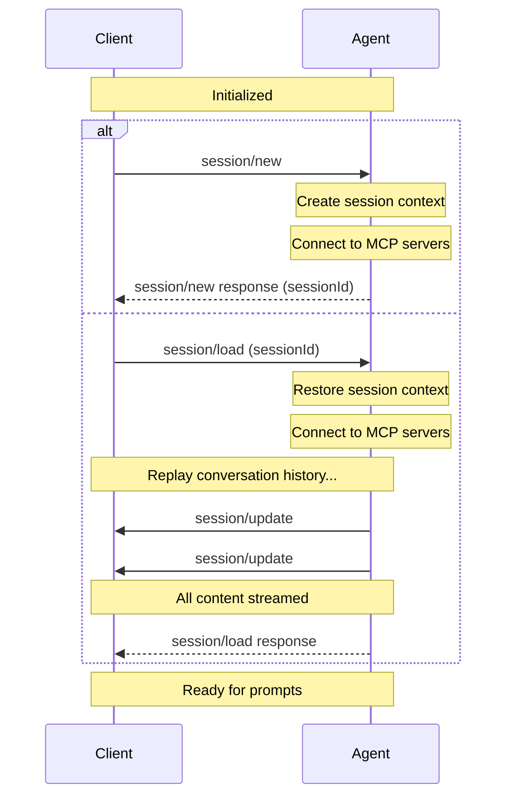

Sessions represent a specific conversation or thread between the [Client](./overview#client) and [Agent](./overview#agent). Each session maintains its own context, conversation history, and state, allowing multiple independent interactions with the same Agent.

Before creating a session, Clients **MUST** first complete the [initialization](./initialization) phase to establish protocol compatibility and capabilities.

<br />



<br />

## Creating a Session

Clients create a new session by calling the `session/new` method with:

- The [working directory](#working-directory) for the session
- A list of [MCP servers](#mcp-servers) the Agent should connect to

```json
{
  "jsonrpc": "2.0",
  "id": 1,
  "method": "session/new",
  "params": {
    "cwd": "/home/user/project",
    "mcpServers": [
      {
        "name": "filesystem",
        "command": "/path/to/mcp-server",
        "args": ["--stdio"],
        "env": []
      }
    ]
  }
}
```

The Agent **MUST** respond with a unique [Session ID](#session-id) that identifies this conversation:

```json
{
  "jsonrpc": "2.0",
  "id": 1,
  "result": {
    "sessionId": "sess_abc123def456"
  }
}
```

## Loading Sessions

Agents that support the `loadSession` capability allow Clients to resume previous conversations. This feature enables persistence across restarts and sharing sessions between different Client instances.

### Checking Support

Before attempting to load a session, Clients **MUST** verify that the Agent supports this capability by checking the `loadSession` field in the `initialize` response:

```json highlight={7}
{
  "jsonrpc": "2.0",
  "id": 0,
  "result": {
    "protocolVersion": 1,
    "agentCapabilities": {
      "loadSession": true
    }
  }
}
```

If `loadSession` is `false` or not present, the Agent does not support loading sessions and Clients **MUST NOT** attempt to call `session/load`.

### Loading a Session

To load an existing session, Clients **MUST** call the `session/load` method with:

- The [Session ID](#session-id) to resume
- [MCP servers](#mcp-servers) to connect to
- The [working directory](#working-directory)

```json
{
  "jsonrpc": "2.0",
  "id": 1,
  "method": "session/load",
  "params": {
    "sessionId": "sess_789xyz",
    "cwd": "/home/user/project",
    "mcpServers": [
      {
        "name": "filesystem",
        "command": "/path/to/mcp-server",
        "args": ["--mode", "filesystem"],
        "env": []
      }
    ]
  }
}
```

The Agent **MUST** replay the entire conversation to the Client in the form of `session/update` notifications (like `session/prompt`).

For example, a user message from the conversation history:

```json
{
  "jsonrpc": "2.0",
  "method": "session/update",
  "params": {
    "sessionId": "sess_789xyz",
    "update": {
      "sessionUpdate": "user_message_chunk",
      "content": {
        "type": "text",
        "text": "What's the capital of France?"
      }
    }
  }
}
```

Followed by the agent's response:

```json
{
  "jsonrpc": "2.0",
  "method": "session/update",
  "params": {
    "sessionId": "sess_789xyz",
    "update": {
      "sessionUpdate": "agent_message_chunk",
      "content": {
        "type": "text",
        "text": "The capital of France is Paris."
      }
    }
  }
}
```

When **all** the conversation entries have been streamed to the Client, the Agent **MUST** respond to the original `session/load` request.

```json
{
  "jsonrpc": "2.0",
  "id": 1,
  "result": null
}
```

The Client can then continue sending prompts as if the session was never interrupted.

## Session ID

The session ID returned by `session/new` is a unique identifier for the conversation context.

Clients use this ID to:

- Send prompt requests via `session/prompt`
- Cancel ongoing operations via `session/cancel`
- Load previous sessions via `session/load` (if the Agent supports the `loadSession` capability)

## Working Directory

The `cwd` (current working directory) parameter establishes the file system context for the session. This directory:

- **MUST** be an absolute path
- **MUST** be used for the session regardless of where the Agent subprocess was spawned
- **SHOULD** serve as a boundary for tool operations on the file system

## MCP Servers

The [Model Context Protocol (MCP)](https://modelcontextprotocol.io) allows Agents to access external tools and data sources. When creating a session, Clients **MAY** include connection details for MCP servers that the Agent should connect to.

MCP servers can be connected to using different transports. All Agents **MUST** support the stdio transport, while HTTP and SSE transports are optional capabilities that can be checked during initialization.

While they are not required to by the spec, new Agents **SHOULD** support the HTTP transport to ensure compatibility with modern MCP servers.

### Transport Types

#### Stdio Transport

All Agents **MUST** support connecting to MCP servers via stdio (standard input/output). This is the default transport mechanism.

<ParamField path="name" type="string" required>
  A human-readable identifier for the server
</ParamField>

<ParamField path="command" type="string" required>
  The absolute path to the MCP server executable
</ParamField>

<ParamField path="args" type="array" required>
  Command-line arguments to pass to the server
</ParamField>

<ParamField path="env" type="EnvVariable[]">
  Environment variables to set when launching the server

  <Expandable title="EnvVariable">
      <ParamField path="name" type="string">
        The name of the environment variable.
      </ParamField>
      <ParamField path="value" type="string">
        The value of the environment variable.
      </ParamField>
  </Expandable>
</ParamField>

Example stdio transport configuration:

```json
{
  "name": "filesystem",
  "command": "/path/to/mcp-server",
  "args": ["--stdio"],
  "env": [
    {
      "name": "API_KEY",
      "value": "secret123"
    }
  ]
}
```

#### HTTP Transport

When the Agent supports `mcpCapabilities.http`, Clients can specify MCP servers configurations using the HTTP transport.

<ParamField path="type" type="string" required>
  Must be `"http"` to indicate HTTP transport
</ParamField>

<ParamField path="name" type="string" required>
  A human-readable identifier for the server
</ParamField>

<ParamField path="url" type="string" required>
  The URL of the MCP server
</ParamField>

<ParamField path="headers" type="HttpHeader[]" required>
  HTTP headers to include in requests to the server

  <Expandable title="HttpHeader">
      <ParamField path="name" type="string">
        The name of the HTTP header.
      </ParamField>
      <ParamField path="value" type="string">
        The value to set for the HTTP header.
      </ParamField>
  </Expandable>
</ParamField>

Example HTTP transport configuration:

```json
{
  "type": "http",
  "name": "api-server",
  "url": "https://api.example.com/mcp",
  "headers": [
    {
      "name": "Authorization",
      "value": "Bearer token123"
    },
    {
      "name": "Content-Type",
      "value": "application/json"
    }
  ]
}
```

#### SSE Transport

When the Agent supports `mcpCapabilities.sse`, Clients can specify MCP servers configurations using the SSE transport.

<Warning>This transport was deprecated by the MCP spec.</Warning>

<ParamField path="type" type="string" required>
  Must be `"sse"` to indicate SSE transport
</ParamField>

<ParamField path="name" type="string" required>
  A human-readable identifier for the server
</ParamField>

<ParamField path="url" type="string" required>
  The URL of the SSE endpoint
</ParamField>

<ParamField path="headers" type="HttpHeader[]" required>
  HTTP headers to include when establishing the SSE connection

  <Expandable title="HttpHeader">
      <ParamField path="name" type="string">
        The name of the HTTP header.
      </ParamField>
      <ParamField path="value" type="string">
        The value to set for the HTTP header.
      </ParamField>
  </Expandable>
</ParamField>

Example SSE transport configuration:

```json
{
  "type": "sse",
  "name": "event-stream",
  "url": "https://events.example.com/mcp",
  "headers": [
    {
      "name": "X-API-Key",
      "value": "apikey456"
    }
  ]
}
```

### Checking Transport Support

Before using HTTP or SSE transports, Clients **MUST** verify the Agent's capabilities during initialization:

```json highlight={7-10}
{
  "jsonrpc": "2.0",
  "id": 0,
  "result": {
    "protocolVersion": 1,
    "agentCapabilities": {
      "mcpCapabilities": {
        "http": true,
        "sse": true
      }
    }
  }
}
```

If `mcpCapabilities.http` is `false` or not present, the Agent does not support HTTP transport.
If `mcpCapabilities.sse` is `false` or not present, the Agent does not support SSE transport.

Agents **SHOULD** connect to all MCP servers specified by the Client.

Clients **MAY** use this ability to provide tools directly to the underlying language model by including their own MCP server.
