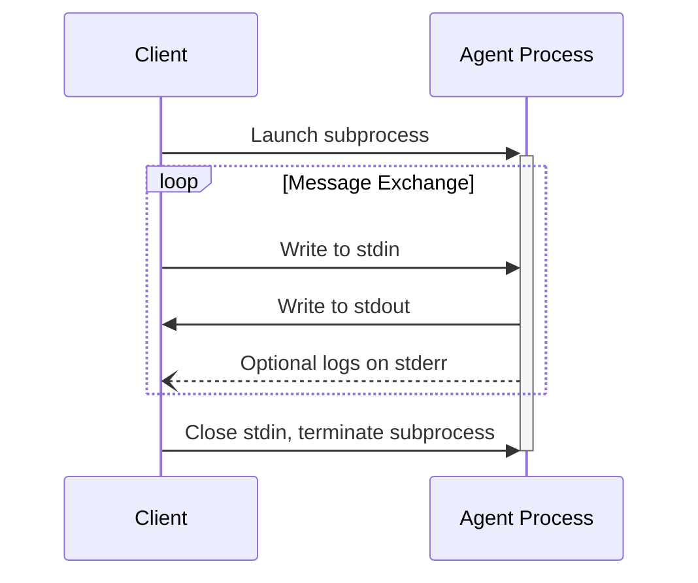

ACP uses JSON-RPC to encode messages. JSON-RPC messages **MUST** be UTF-8 encoded.

The protocol currently defines the following transport mechanisms for agent-client communication:

1. [stdio](#stdio), communication over standard in and standard out
2. _[Streamable HTTP](#streamable-http) (draft proposal in progress)_

Agents and clients **SHOULD** support stdio whenever possible.

It is also possible for agents and clients to implement [custom transports](#custom-transports).

## stdio

In the **stdio** transport:

- The client launches the agent as a subprocess.
- The agent reads JSON-RPC messages from its standard input (`stdin`) and sends messages to its standard output (`stdout`).
- Messages are individual JSON-RPC requests, notifications, or responses.
- Messages are delimited by newlines (`\n`), and **MUST NOT** contain embedded newlines.
- The agent **MAY** write UTF-8 strings to its standard error (`stderr`) for logging purposes. Clients **MAY** capture, forward, or ignore this logging.
- The agent **MUST NOT** write anything to its `stdout` that is not a valid ACP message.
- The client **MUST NOT** write anything to the agent's `stdin` that is not a valid ACP message.

## _Streamable HTTP_

_In discussion, draft proposal in progress._

## Custom Transports

Agents and clients **MAY** implement additional custom transport mechanisms to suit their specific needs. The protocol is transport-agnostic and can be implemented over any communication channel that supports bidirectional message exchange.

Implementers who choose to support custom transports **MUST** ensure they preserve the JSON-RPC message format and lifecycle requirements defined by ACP. Custom transports **SHOULD** document their specific connection establishment and message exchange patterns to aid interoperability.
